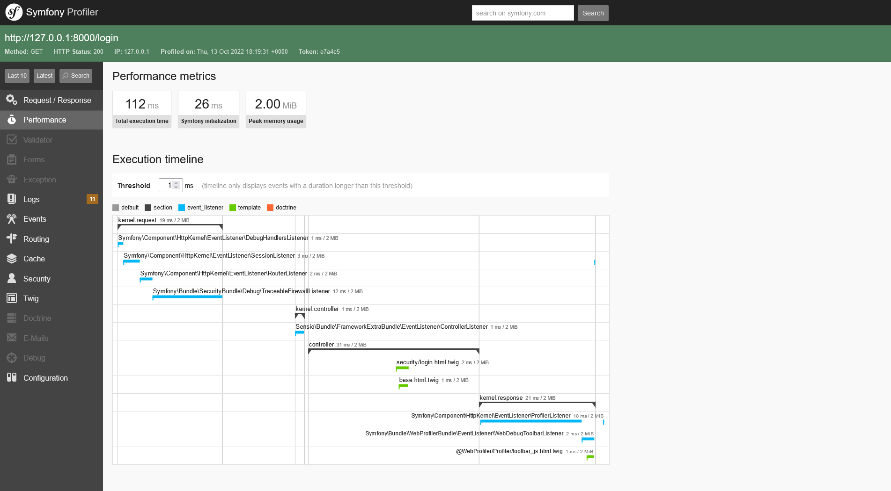
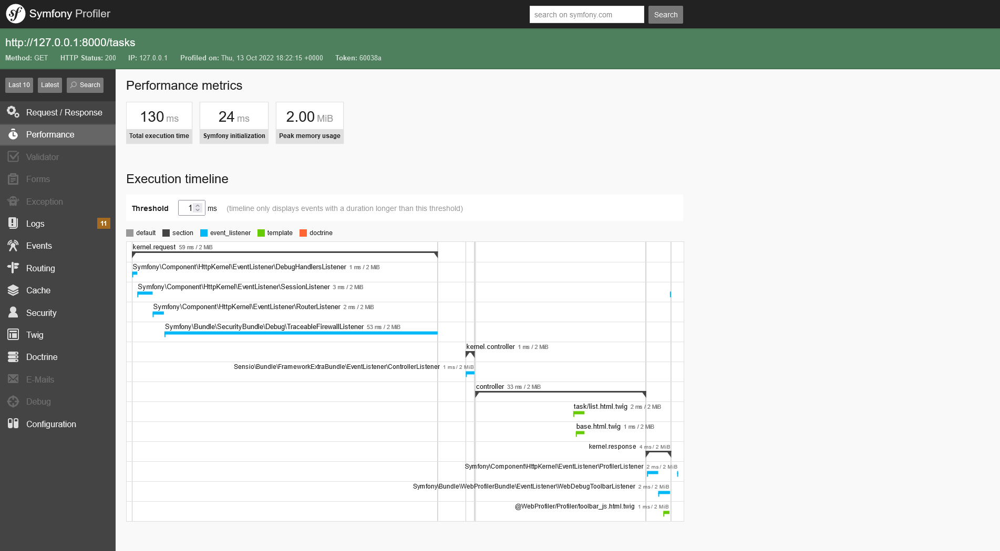
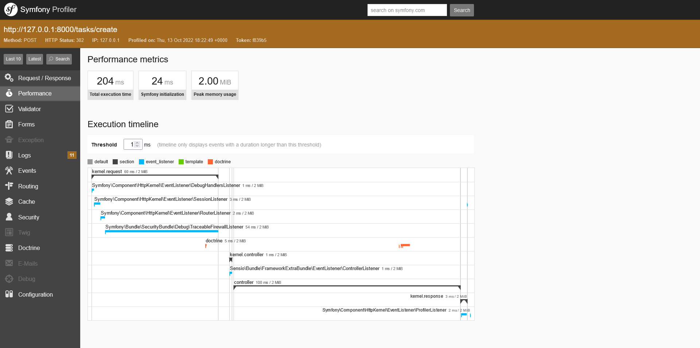
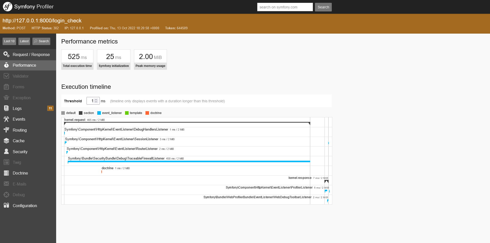
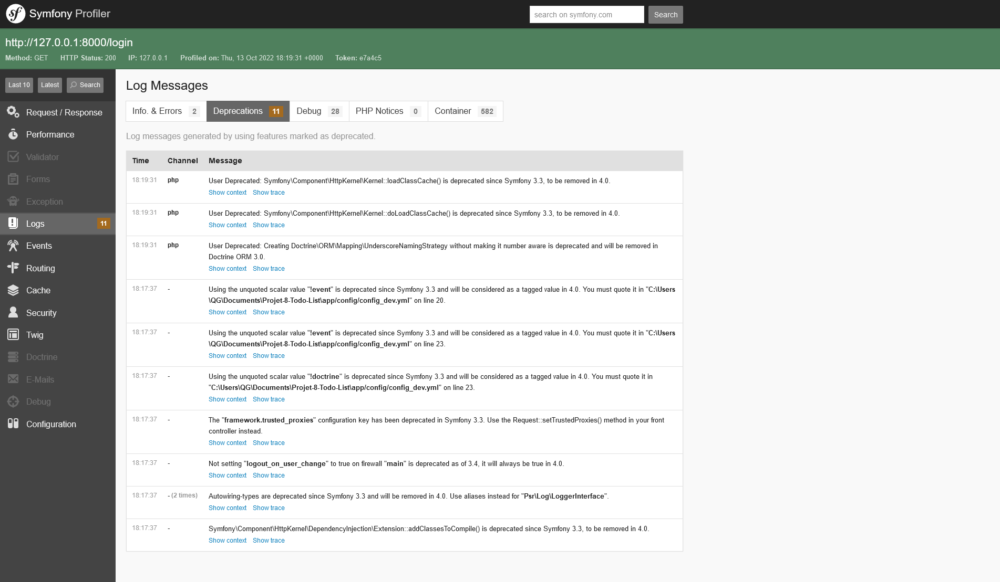
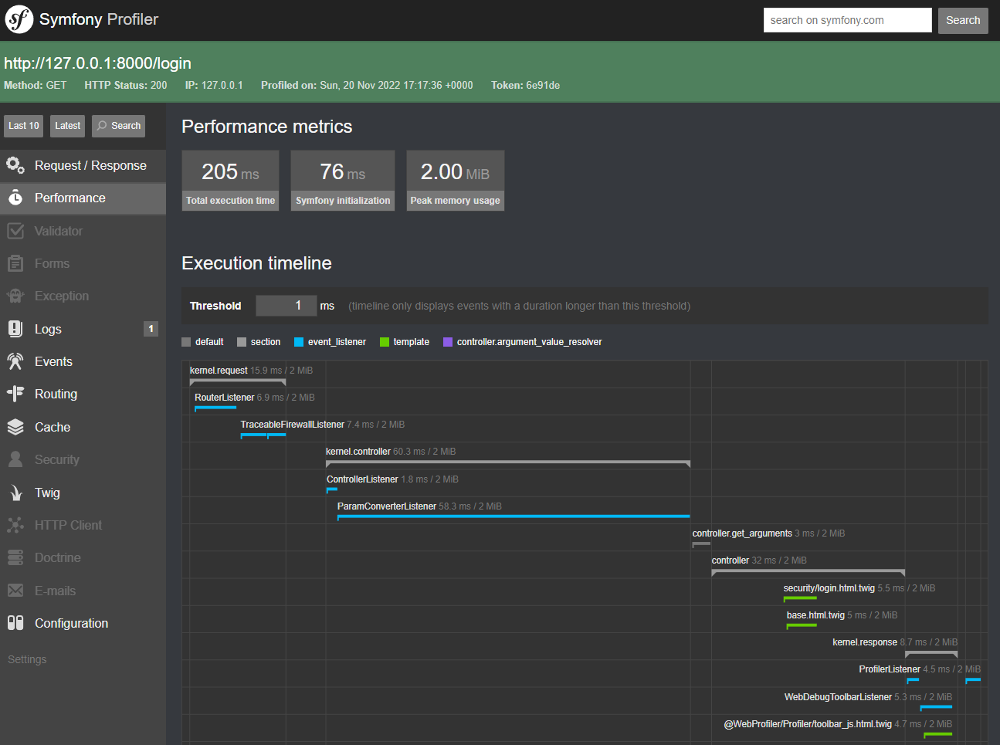
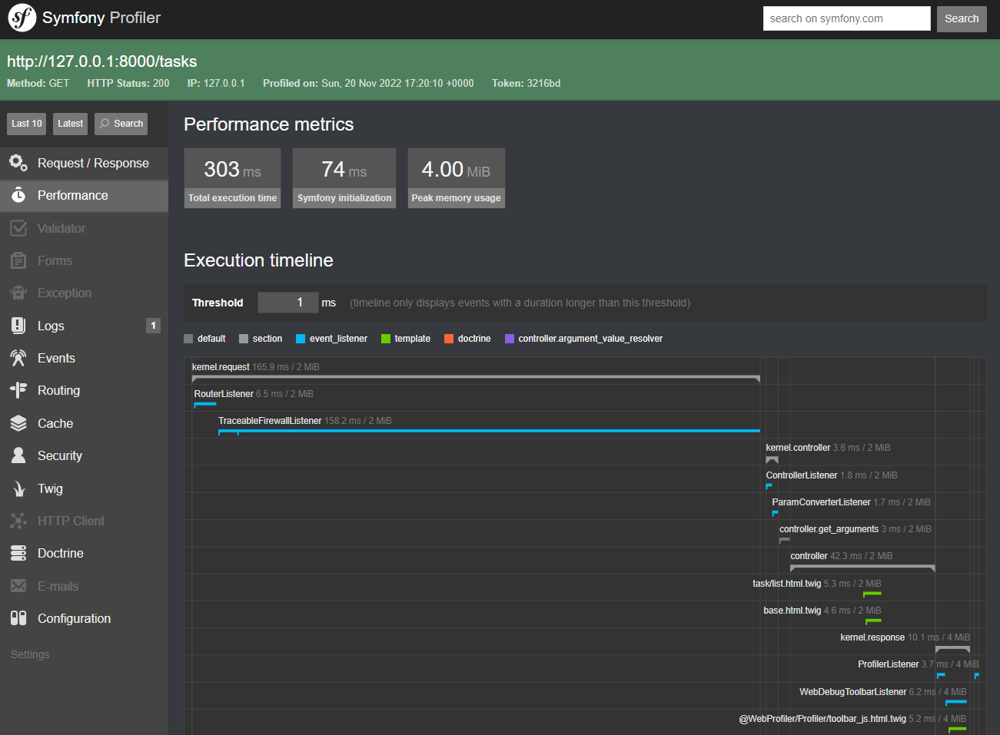
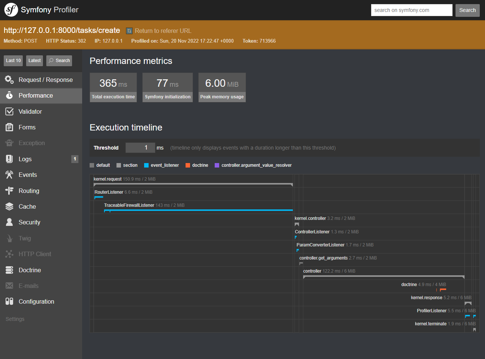
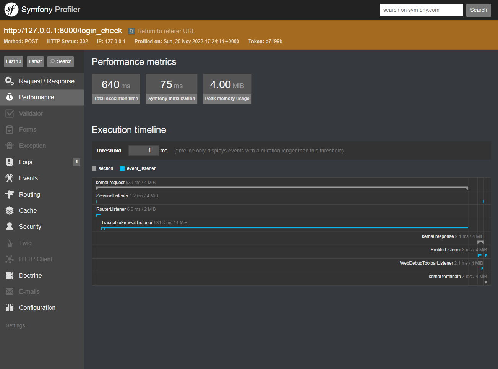

# Audit de l'application

## Version Symfony

Le site **ToDoList** est une application web en **Symfony** devenue obsolète avec le temps. Son dernier commit datant du 18 Novembre 2016, elle n'a pas reçu de mise-à-jour depuis. Par conséquent, le Framework **Symfony** est à la version **3.1.0**, une version qui n'est plus maintenue par leur créateurs aujourd'hui et qui nécessite **PHP 5.5**. 

Utiliser Symfony dans cet état poserait plusieurs problèmes notamment de manque de maintenabilité de l'outil, de possibles failles de sécurité (nombreuses failles connue aujourd'hui ont justement été corrigés dans les versions suivantes), un manque de performance, etc... Il est donc impératif de migrer le projet vers une version plus récente toujours maintenue.

## Performances

Voici l'analyse de quelques requêtes sélectionnés, leurs temps de réponse et l'usage de la mémoire vive du serveur. Ces tests ont été réalisé en local via Symfony Profiler.

| Method | Endpoints | Execution Time | Peak Memory usage |
|------------ | ------------ | ------------ | ------------ |
| GET | /login | 112ms | 2mb |
| GET | /tasks | 130ms | 2mb |
| POST | /tasks/create | 204ms | 2mb |
| POST | /login_check | 525ms | 2mb |

Les résultats montrent des valeurs correctes en général avec un axe d'amélioration sur ``/login_check``.

*Sur l'image on peut voir que la majorité du délai vient de `TraceableFirewallListener`. Celui-ci n'étant qu'un wrapper, il faudrait une analyse plus approfondie à l'aide d'autres outils. [détails](https://github.com/symfony/symfony/issues/24838#issuecomment-396222864) Il semblerait cependant que le délai soit issu du cout d'hachage du mot-de-passe. Il ne serait donc pas désirable de le réduire*

## Obsolescence

Symfony Profiler met aussi en avant les nombreuses méthodes et fonctionnalités obsolètes de cette version comme sur l'image ci-dessous. Il s'agit là aussi d'un axe important d'amélioration.

## Migration vers Symfony 6.1

| Method | Endpoints | Execution Time | Peak Memory usage | Evolution |
|------------ | ------------ | ------------ | ------------ | ------------ |
| GET | /login | 205ms | 2mb | +83% |
| GET | /tasks | 303ms | 2mb | +133% |
| POST | /tasks/create | 365ms | 6mb | +78% |
| POST | /login_check | 640ms | 4mb | +21% |

L'analyse montre des hausses du temps d'exécution qui se justifierait peut-être par un Framework Symfony plus robuste et l'ajout des nouvelles fonctionnalités. Ces délais restent néanmoins corrects.

## Tests automatisés

L'un des axes d'améliorations effectués, est la mise en place des tests unitaires et fonctionnels de l'application ainsi que la mise en place de l'intégration continue. Voici un résumé des résultats de la couverture de ces tests.

#### Couverture des tests

|  | **Lines** | **Functions and Methods** | **Classes and Traits** | 
|------------ | ------------ | ------------ | ------------ | 
| **Total** | 98.61% | 95.83%  | 90.00%  |
| **Controller** | 96.88% | 84.62% | 75.00% |
| **DataFixtures** | 100.00% | 100.00% | 100.00% |
| **Entity** | 100.00% | 100.00% | 100.00% |
| **Form** | 100.00% | 100.00% | 100.00% |

