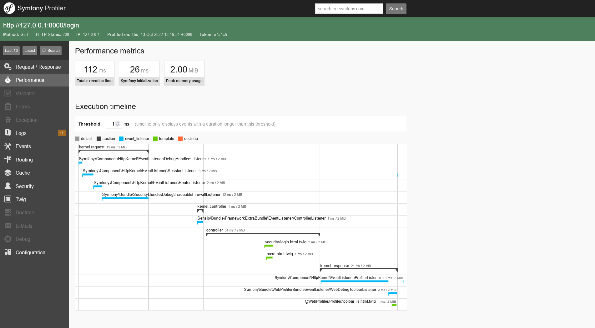
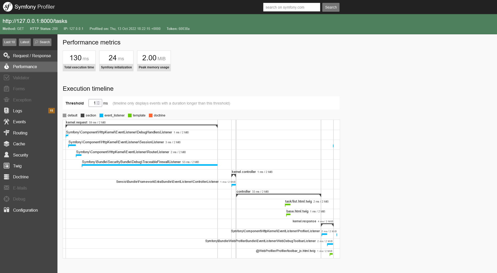
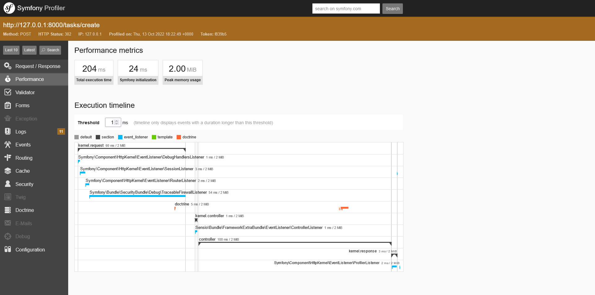
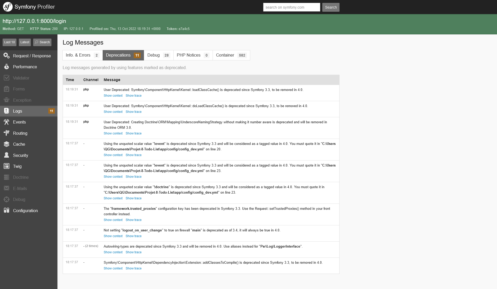
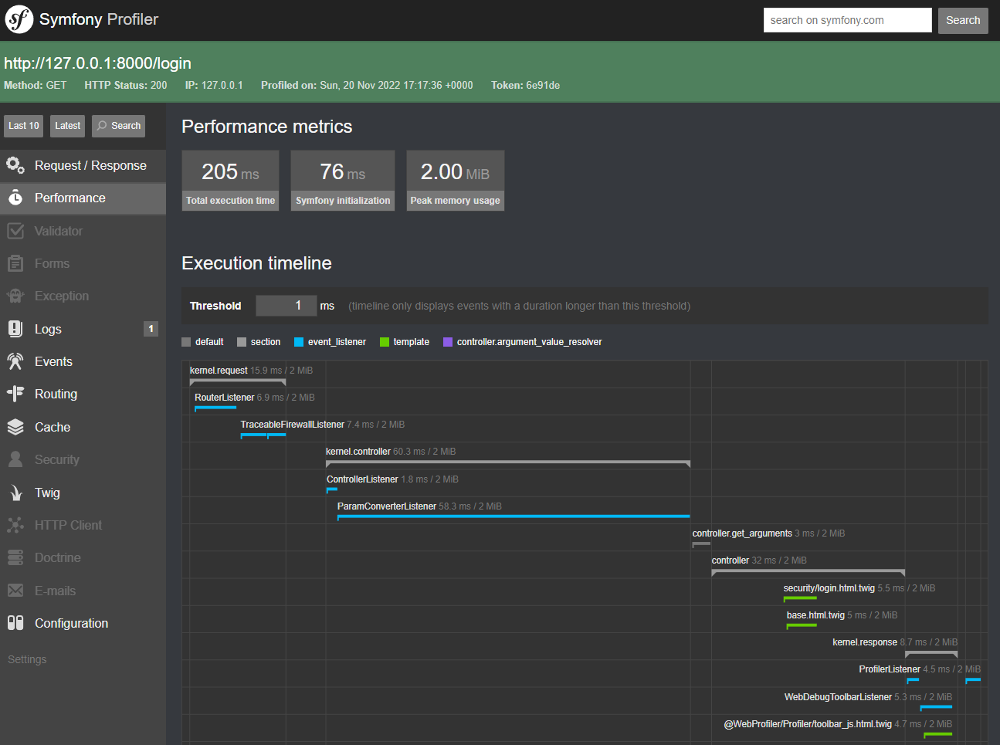
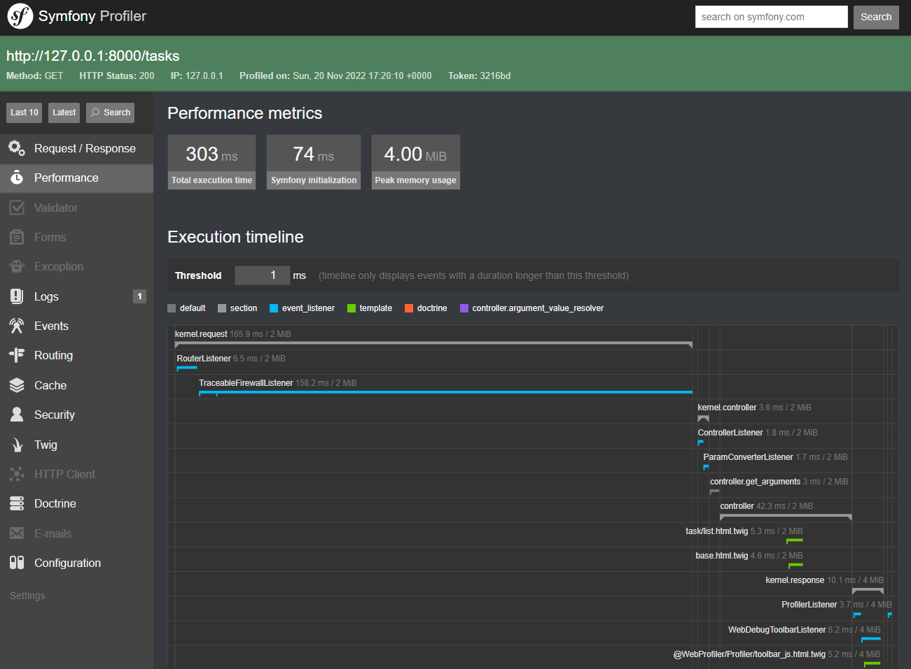
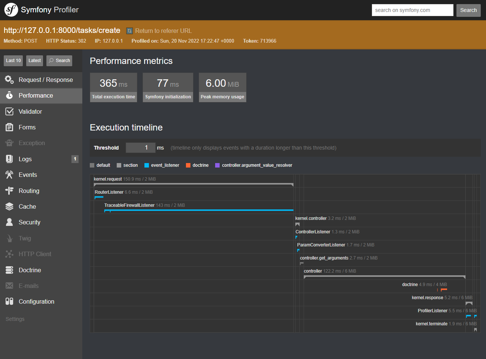
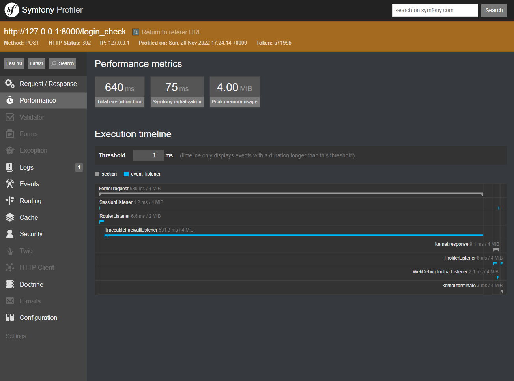
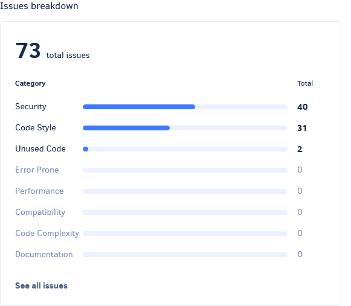
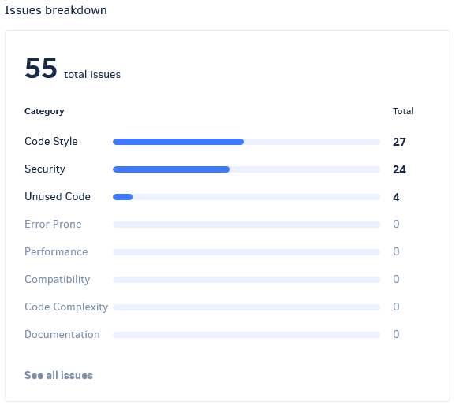

# Audit de l'application

## Version Symfony
Le site **To Do List** est une application web en **Symfony** devenue obsolète avec le temps. Son dernier commit datant du 18 Novembre 2016, elle n'a pas reçu de mise-à-jour depuis. Par conséquent, le Framework **Symfony** est à la version **3.1.0**, une version qui n'est plus maintenue par leurs créateurs aujourd'hui et qui nécessite **PHP 5.5**. 

Utiliser Symfony dans cet état poserait plusieurs problèmes notamment de manque de maintenabilité de l'outil, de possibles failles de sécurité (nombreuses failles connues aujourd'hui ont justement été corrigées dans les versions suivantes), un manque de performance, etc... Il est donc impératif de migrer le projet vers une version plus récente toujours maintenue.

## Performances
Voici l'analyse de quelques requêtes sélectionnées où sont indiqués leurs temps d'exécution et la quantité de mémoire vive utilisée. Ces tests ont été réalisés en local via Symfony Profiler.

| Method | Endpoints | Execution Time | Peak Memory usage |
|------------ | ------------ | ------------ | ------------ |
| GET | /login | 112ms | 2mb |
| GET | /tasks | 130ms | 2mb |
| POST | /tasks/create | 204ms | 2mb |
| POST | /login_check | 525ms | 2mb |
Ces résultats montrent des valeurs correctes en général avec un axe d'amélioration sur ``/login_check``.

*On peut voir sur l'image que la majorité du délai vient de `TraceableFirewallListener`. Celui-ci n'étant qu'un wrapper, il faudrait une analyse plus approfondie à l'aide d'autres outils pour avoir plus de détails sur le service en question. Il semblerait cependant que le délai soit issu du coût de hachage du mot-de-passe. Il ne serait donc pas désirable de le réduire.*

## Obsolescence
**Symfony Profiler** met aussi en avant les nombreuses méthodes et fonctionnalités obsolètes de cette version comme sur l'image ci-dessous. Il s'agit là aussi d'un axe important d'amélioration.

## Migration vers Symfony 6.1
Suite à notre intervention sur l'application, une migration vers **Symfony 6.1** a été effectuée. Il s'agit d'un axe majeur dans la réduction de la dette technique de l'application.

| Method | Endpoints | Execution Time | Peak Memory usage | Evolution |
|------------ | ------------ | ------------ | ------------ | ------------ |
| GET | /login | 205ms | 2mb | +83% |
| GET | /tasks | 303ms | 2mb | +133% |
| POST | /tasks/create | 365ms | 6mb | +78% |
| POST | /login_check | 640ms | 4mb | +21% |
L'analyse montre des hausses du temps d'exécution qui se justifierait peut-être par un Framework Symfony plus robuste et l'ajout des nouvelles fonctionnalités. Ces délais restent néanmoins corrects.

## Tests automatisés
L'un des axes d'amélioration effectué, est la mise en place des tests unitaires et fonctionnels de l'application ainsi que la mise en place de l'intégration continue. Voici un résumé des résultats de la couverture de ces tests.

#### Couverture des tests
|  | **Lines** | **Functions and Methods** | **Classes and Traits** | 
|------------ | ------------ | ------------ | ------------ | 
| **Total** | 98.61% | 95.83%  | 90.00%  |
| **Controller** | 96.88% | 84.62% | 75.00% |
| **DataFixtures** | 100.00% | 100.00% | 100.00% |
| **Entity** | 100.00% | 100.00% | 100.00% |
| **Form** | 100.00% | 100.00% | 100.00% |

## Qualité du code

Pour ce qui concerne l'analyse de qualité du code, le projet a une note **B** sur **Codacy** avec un total de **55 *issues*** contre **73** au début du projet. [Plus de détails](https://app.codacy.com/gh/guicima/Projet-8-Todo-List/dashboard) Il s'agit là d'un très bon score avec aucun *issue* critique mais il reste encore **24 *issues*** liés à l'aspect sécurité qui doivent être corrigés.

#### Avant

#### Après
